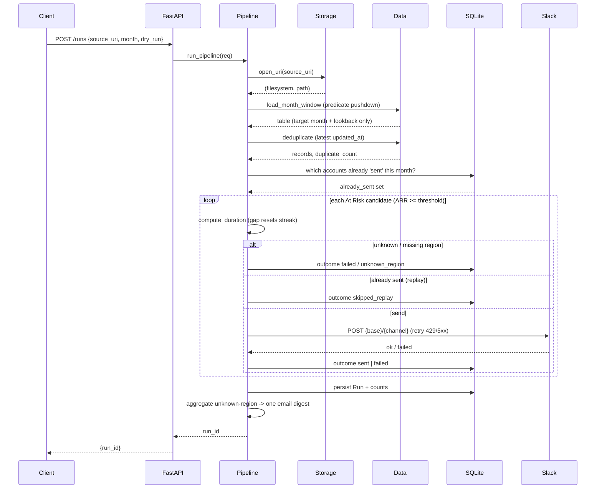

# Architecture

## Component diagram

```mermaid
flowchart TD
    Client[Client / Batch trigger] -->|POST /runs, /preview| API[FastAPI app.main]
    API --> Pipeline[pipeline.run_pipeline / preview]

    Pipeline --> Storage[storage.open_uri]
    Storage -->|file://| Local[(Local FS)]
    Storage -->|gs://| GCS[(Google Cloud Storage)]
    Storage -.->|s3:// designed| S3[(S3 — stub)]

    Pipeline --> Data[data.load_month_window + deduplicate]
    Data -->|predicate pushdown| Parquet[(Parquet)]

    Pipeline --> Duration[duration.compute_duration]
    Pipeline --> Slack[slack.SlackClient]
    Slack -->|retry 429/5xx + Retry-After| Webhook[Slack webhook / mock]

    Pipeline --> DB[(SQLite: runs + alert_outcomes)]
    Pipeline --> Email[notifications.send_unknown_region_digest]
    Email -.->|stub| Support[support@quadsci.ai]
```

## Sequence: `POST /runs`



## Key invariants
- **Predicate pushdown**: only the target month + lookback window is read from Parquet.
- **Dedup ≠ idempotency**: dedup resolves duplicate input rows (data quality); the UNIQUE
  constraint on `(account_id, month, alert_type)` prevents duplicate Slack posts on replay
  (operational safety).
- **No default channel**: unknown/missing regions never send; they fail with
  `unknown_region` and are surfaced in one aggregated email.
- **Run completes on partial failure**: a failed Slack delivery is recorded, not fatal.
- **Dry run** computes + persists run-level counts but writes no `alert_outcomes`, so it
  never occupies the idempotency slot.
